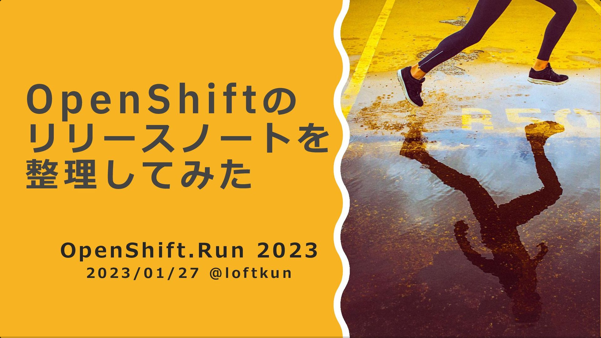
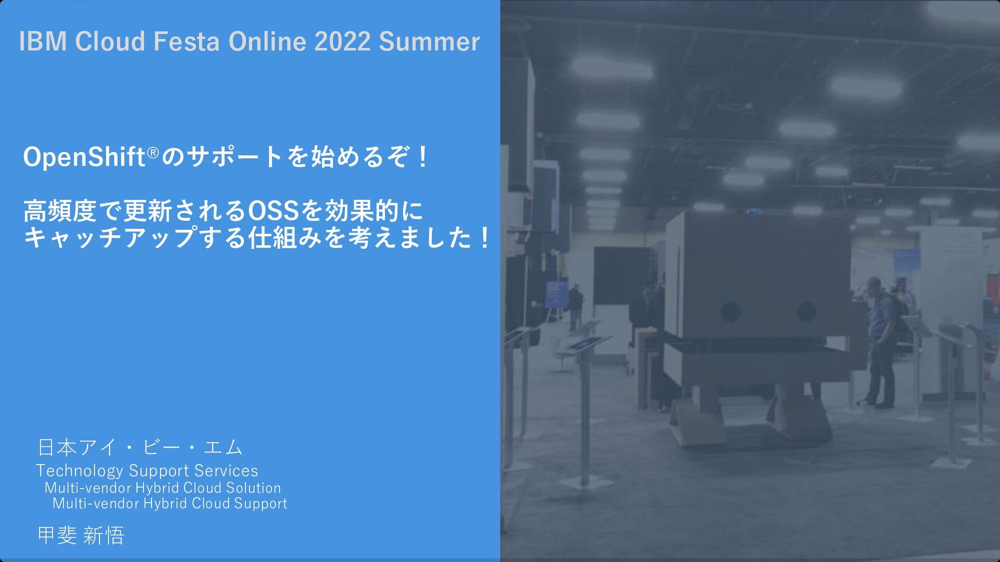
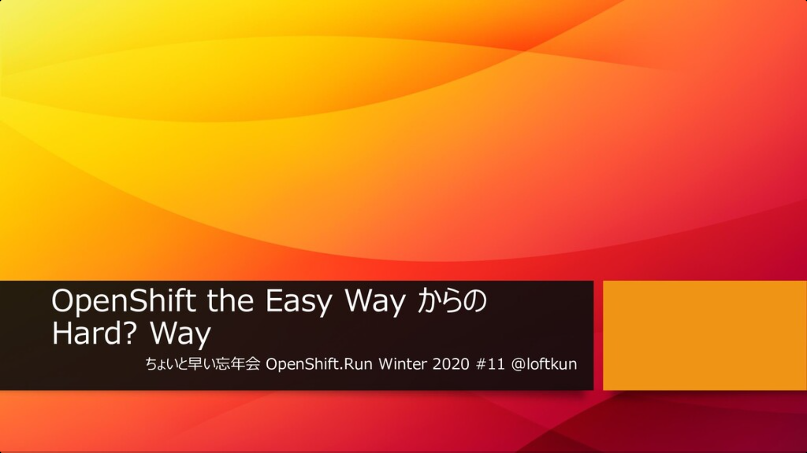
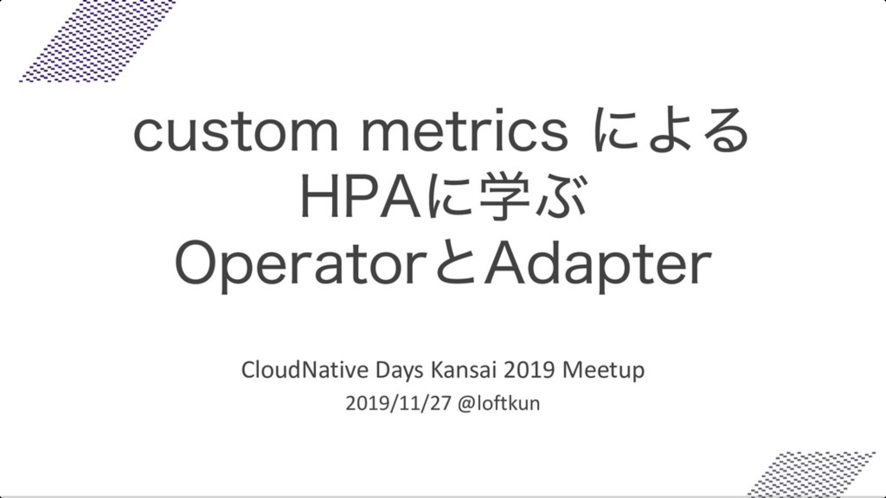

# loftkun

## please follow me

- [X](https://twitter.com/loftkun)
- [Qiita](https://qiita.com/loftkun)
- [Linkedin](https://www.linkedin.com/in/loftkun/)

## my positions

- current ( at IBM Japan )
  - Red Hat Certified Specialist in OpenShift Administration
  - Professional Technical Support for Red Hat OpenShift, Red Hat Enterprise Linux and various OSS ( OpenJDK, PostgreSQL, ActiveMQ, etc )
- past
  - SWE ( Embedded , Linux Device Driver, Image Processing )
  - SRE

## presentation

OpenShift.Run 2023

IBM Cloud Festa 2022 Summer

VSCode Conference Japan 2021

OpenShift.Run 2020

CloudNative Days Kansai 2019 Meetup 

## history

**About 11 years(2007-2018) as a software engineer** developing Linux Device Driver, FPGA firmware, Java Servlet, Java/JVMTI Agent, Android Application(using NDK) , etc using OpenGL(GLSL), DPDK(pktgen), Nginx, JMeter, Docker, AWS CodeBuild, Kubernetes/Minikube, Helm, Istio, GitLab CI/CD, Spinnaker, etc for development of Fujitsu’s [broadsight system ( "IP" series )](https://www.fujitsu.com/jp/products/network/broadsight/) and [network emulation ( "NXS-PE" )](https://www.fujitsu.com/jp/documents/products/network/events/2016/interop/nxs-pe-v.pdf) / [packet generation ( "NXS-PG" ) systems](https://www.fujitsu.com/jp/documents/products/network/events/2016/interop/nxs-pg-v.pdf) offered from Fujitsu and research project of JavaVM and service mesh, microservice on Kubernetes offered from Fujitsu Laboratories.

**About 2 years(2018-2020) as SRE at Yahoo! Japan** using Spring Boot, Chef/Ansible, MQ(Pulsar), CI/CD(GitHub Actions, Screwdriver), Prometheus/Grafana, etc for DevOps for content submission system ( using FTP and S3(ICOS) )from outside the company and internal alert systems ( using Twilio ).

**From 2020/8, I am currently working at IBM Japan as a Technical Support Professional** for Red Hat products ( Red Hat Enterprise Linux and Red Hat OpenShift ) and various OSS such as Kubernetes, PostgreSQL, OpenJDK, and creating update plans of OpenShift on IBM Cloud and RHEL server for our customers.

I build Red Hat OpenShift environments, test features( ArgoCD, Tekton, Istio, Knative ) and share results so that the organization can provide useful support to the customers.

I also lead a team that develops internal tools to improve the quality of service in the technical support department.

## activities in the engineering community

In addition, as personal activities outside of work, I speak at workshops and conferences related to container technology and Python programming, etc., and manage them as an executive committee member.

For example, I like VSCode and I am a member of the organizing committee for “VSCode Conference Japan”.
